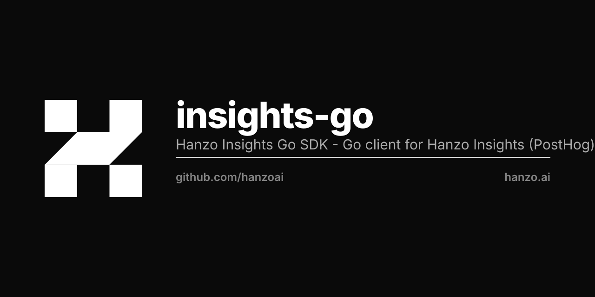

<p align="center"></p>

# Hanzo Insights Go SDK

[](https://pkg.go.dev/github.com/hanzoai/insights-go)
[](https://goreportcard.com/report/github.com/hanzoai/insights-go)
[](https://opensource.org/licenses/MIT)

Go client SDK for Hanzo Insights (product analytics).

## Install

```bash
go get github.com/hanzoai/insights-go
```

## Quick Start

```go
package main

import (
    "os"

    insights "github.com/hanzoai/insights-go"
)

func main() {
    client, _ := insights.NewWithConfig(
        os.Getenv("INSIGHTS_API_KEY"),
        insights.Config{
            Endpoint: "https://insights.hanzo.ai",
        },
    )
    defer client.Close()

    // Capture an event
    client.Enqueue(insights.Capture{
        DistinctId: "user-123",
        Event:      "purchase",
        Properties: insights.NewProperties().
            Set("plan", "enterprise").
            Set("amount", 99),
    })
}
```

## Common Operations

### Capture Events

```go
client.Enqueue(insights.Capture{
    DistinctId: "user-123",
    Event:      "page_view",
    Properties: insights.NewProperties().
        Set("$current_url", "https://example.com/pricing"),
})
```

### Identify Users

```go
client.Enqueue(insights.Identify{
    DistinctId: "user-123",
    Properties: insights.NewProperties().
        Set("email", "alice@example.com").
        Set("name", "Alice").
        Set("plan", "pro"),
})
```

### Feature Flags

```go
// Check if a flag is enabled
enabled, err := client.IsFeatureEnabled(
    insights.FeatureFlagPayload{
        Key:        "new-dashboard",
        DistinctId: "user-123",
    },
)

if enabled == true {
    // Show new dashboard
}

// Get flag variant
variant, err := client.GetFeatureFlag(
    insights.FeatureFlagPayload{
        Key:        "checkout-flow",
        DistinctId: "user-123",
    },
)
```

### Group Analytics

```go
// Associate a user with a group
client.Enqueue(insights.GroupIdentify{
    Type: "company",
    Key:  "hanzo-ai",
    Properties: insights.NewProperties().
        Set("name", "Hanzo AI").
        Set("industry", "technology"),
})

// Capture event with group context
client.Enqueue(insights.Capture{
    DistinctId: "user-123",
    Event:      "deploy",
    Groups: insights.NewGroups().
        Set("company", "hanzo-ai"),
})
```

### Alias Users

```go
client.Enqueue(insights.Alias{
    DistinctId: "user-123",
    Alias:      "user-456",
})
```

## Configuration

```go
client, _ := insights.NewWithConfig(
    os.Getenv("INSIGHTS_API_KEY"),
    insights.Config{
        Endpoint:       "https://insights.hanzo.ai",
        PersonalApiKey: os.Getenv("INSIGHTS_PERSONAL_KEY"), // For local feature flag evaluation
        BatchSize:      100,
        Interval:       5 * time.Second,
        MaxRetries:     insights.Ptr(3),
        RetryAfter: func(attempt int) time.Duration {
            return time.Duration(100<<attempt) * time.Millisecond
        },
    },
)
```

## Event Delivery

The SDK includes automatic retry logic with configurable backoff. Events are retried on transient network failures (EOF, connection reset, temporary unavailability). Events are dropped after max retries are exhausted (default: 10 attempts), on non-retryable errors (4xx responses), or if the client is closed during retry.

Monitor delivery with a callback:

```go
type DeliveryLogger struct{}

func (d *DeliveryLogger) Success(msg insights.APIMessage) {
    log.Printf("delivered: %v", msg)
}

func (d *DeliveryLogger) Failure(msg insights.APIMessage, err error) {
    log.Printf("dropped: %v err=%v", msg, err)
}

client, _ := insights.NewWithConfig(apiKey, insights.Config{
    Callback: &DeliveryLogger{},
})
```

## Development

```bash
make dependencies   # Install deps
make build          # Run tests and build
make test           # Run tests only
```

## Attribution

Based on PostHog Go SDK. See upstream LICENSE for attribution.

## License

MIT License. Copyright (c) Hanzo AI Inc.
